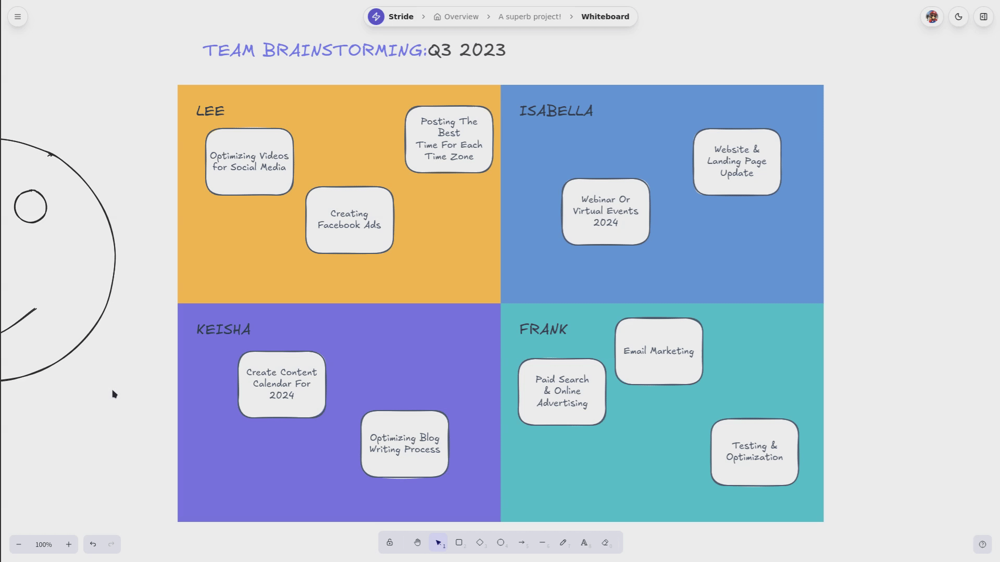
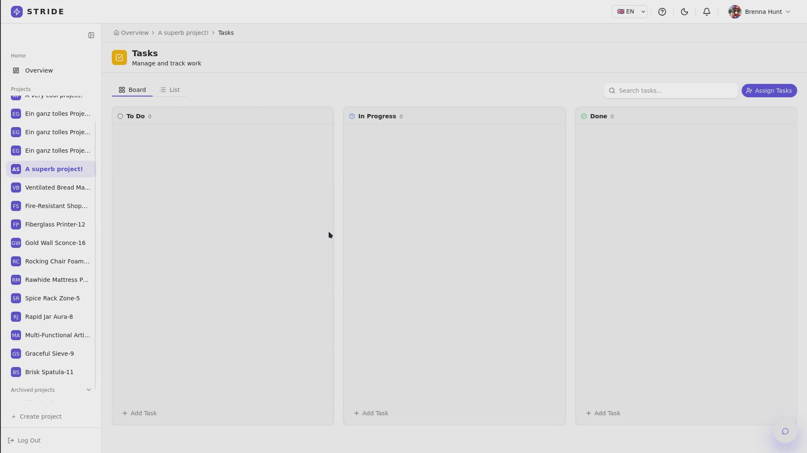
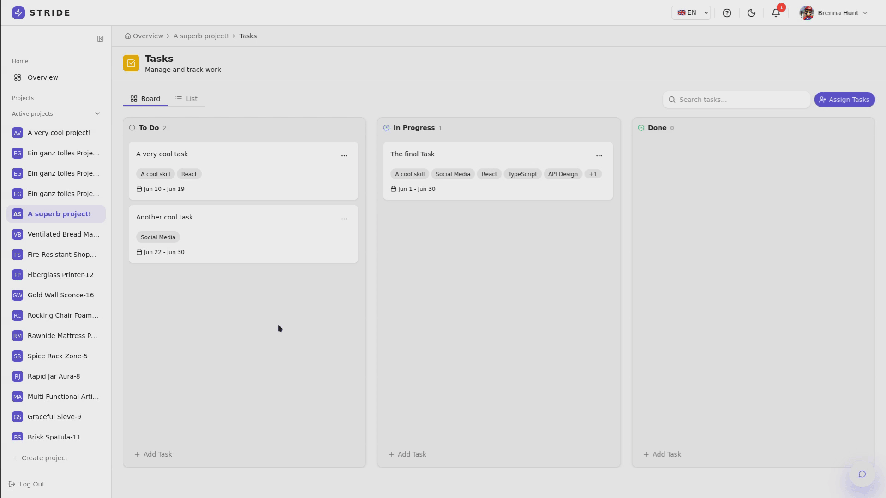
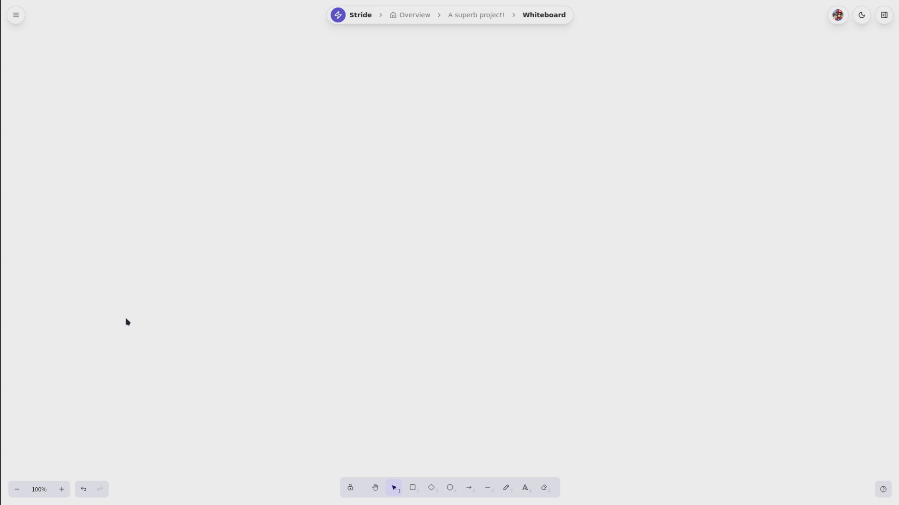
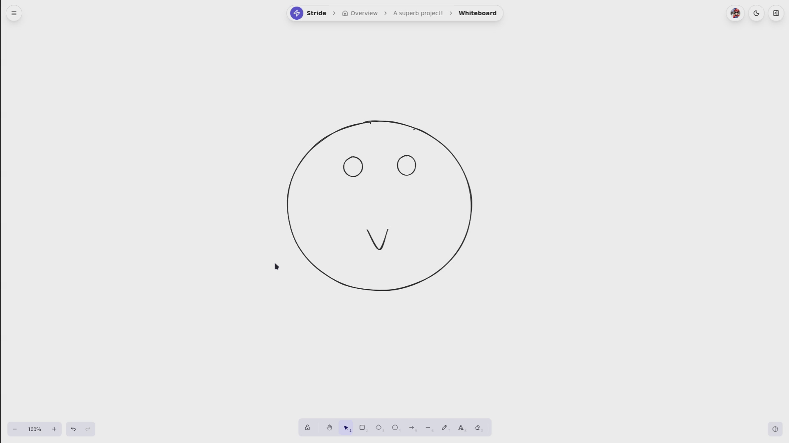
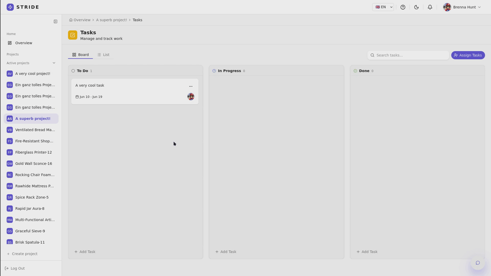
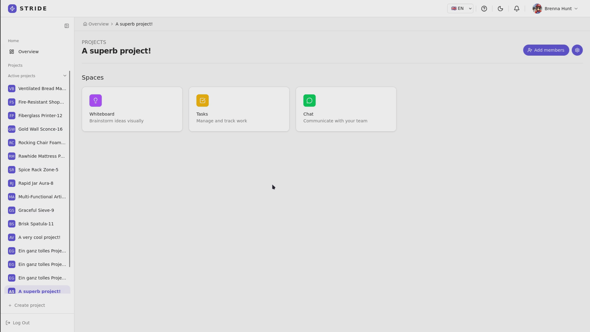
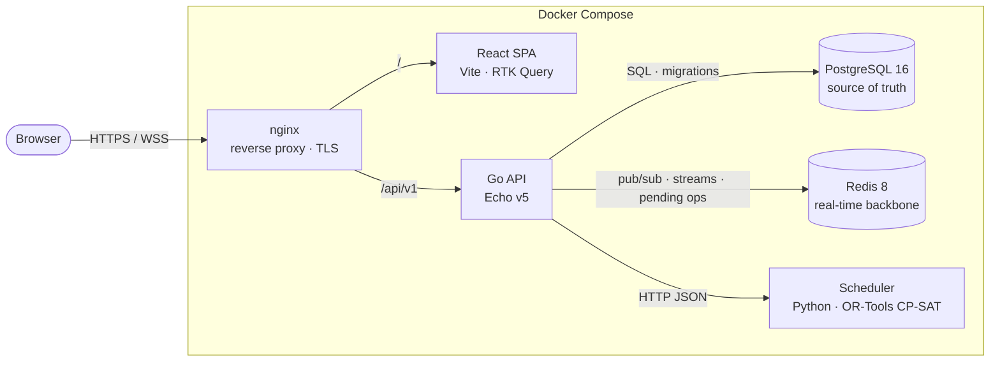
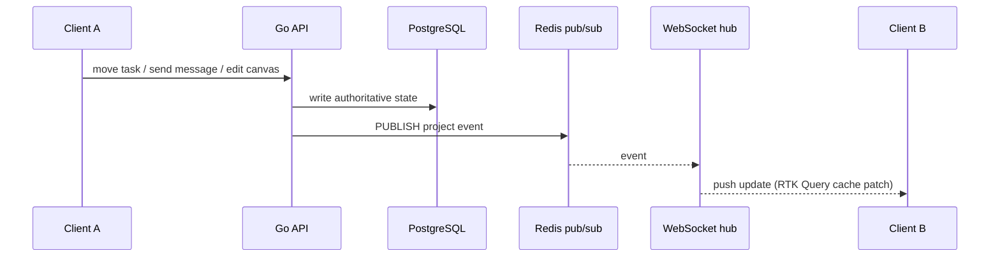
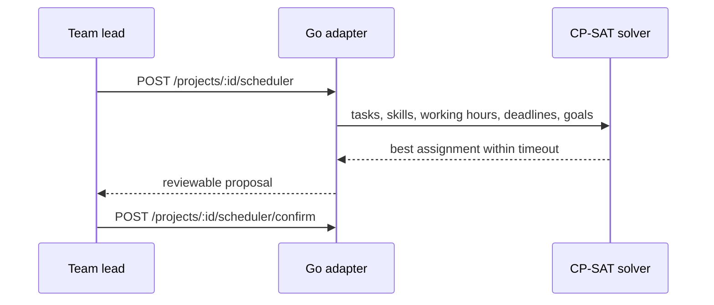

<div align="center">

<h1>STRIDE</h1>

<p><strong>Self-hostable team workspace: Kanban tasks, real-time chat, a shared whiteboard, and a constraint-solver task scheduler in one Docker Compose stack.</strong></p>

<p>
  <a href="#quick-start">Quick start</a> ·
  <a href="#features">Features</a> ·
  <a href="#architecture">Architecture</a> ·
  <a href="#documentation">Docs</a> ·
  <a href="#team">Team</a>
</p>

<p>
  
  
  
  
  
  
  
  <a href="LICENSE"></a>
</p>



</div>

---

## About

STRIDE is a workspace for software teams that you host yourself. Projects, a Kanban board, chat and a shared whiteboard sit in one place, and every change shows up live in all open browsers. A constraint solver suggests who should work on which task, based on skills, working hours and deadlines. A team lead reviews each suggestion before it is applied. The whole stack installs on a server with one command.

STRIDE was built as an *Advanced Software Engineering* project at **TU Wien**.

<div align="center">

| 776 commits | 98 merged PRs | ~50k lines | 11 ADRs | 200+ automated tests |
| :---------: | :-----------: | :--------: | :-----: | :------------------: |
| 5 engineers | reviewed MRs | Go · TS · Python | arc42 docs | Go · Vitest · Playwright |

</div>

---

## Features

<table>
<tr>
<td width="50%" valign="top">

### Projects & roles
Create, archive and delete projects. Invite members as **Owner** or **Member**. Archived projects become read-only across tasks, chat and whiteboard.

### Kanban board
Drag-and-drop board built on `dnd-kit`. A **state machine** enforces `Backlog → In Progress → Review → Done`. Tasks carry estimates, deadlines, required skills and multiple assignees.

### Real-time chat
Chat per project, available on every page as a side panel. **Read receipts** use per-member delivered/read cursors.

</td>
<td width="50%" valign="top">

### Collaborative whiteboard
An **Excalidraw** canvas with live element sync, live cursors, a collaborator list, templates, and **task ↔ region linking**. Edits are debounced into Redis and a background worker flushes them to PostgreSQL.

### Automated scheduler
A **Google OR-Tools CP-SAT** solver assigns tasks by skill, working hours, estimates and deadlines. Optimization goals can be stacked. Nothing is applied until a human reviews and confirms the proposal.

### Notifications & i18n
Per-user notifications backed by **Redis Streams**, with snapshot replay on reconnect. Full English and German UI, dark mode, and a responsive layout.

</td>
</tr>
</table>

<details>
<summary><b>See it in action</b></summary>
<br />

| Kanban & tasks | Scheduler |
| :---: | :---: |
|  |  |
| **Whiteboard** | **Chat everywhere** |
|  |  |
| **Skills** | **Project members** |
|  |  |

</details>

---

## Quick start

**Requirements:** Docker with Compose v2. Nothing else runs on the host.

```bash
git clone https://github.com/advxolltm/stride.git && cd stride
cp .env.example .env
./stride devrun
```

Open **http://localhost:8080** and sign in with the development superuser:

| Username | Email | Password |
| --- | --- | --- |
| `admin` | `admin@example.com` | `Password123!` |

<details>
<summary><b>Without the CLI</b></summary>

```bash
docker compose -f compose.dev.yml up -d --build
curl -s http://localhost:8080/api/v1/health
```

</details>

### The `stride` CLI

```text
./stride start              Interactive production setup and start
./stride devrun             Start the development Docker Compose stack
./stride down [prod|dev]    Stop a stack, defaults to prod
./stride restart [prod|dev] Restart containers, defaults to prod
./stride certificate        Configure production TLS certificates
./stride test               Run frontend and backend test cycle
```

### Production

```bash
./stride start
```

The interactive setup:

- writes `.env` and asks for the deployment mode (public internet or VPN/corporate network)
- issues TLS certificates with `certbot`, or takes your own certificate files, and installs a renewal cron job
- starts `compose.prod.yml` and creates the first superuser

Only nginx is exposed (ports 80/443). PostgreSQL, Redis, the API and the solver stay on the internal Docker network. Persistent data lives in `./data/{db,redis,media}`.

| `APPLICATION_MODE` | Registration |
| --- | --- |
| `closed_network` *(default)* | Open self-registration. Meant for VPN or intranet installs. |
| `closed_auth` | Only superusers can create accounts. Meant for public internet installs. |

---

## Architecture

STRIDE is a **modular monolith** ([ADR-0006](docs/architecture/adr/0006-modular-monolith-vs-microservices.md)). One Go API holds all business modules. PostgreSQL is the only source of truth, and Redis carries everything live. The CP-SAT solver runs as a small Python sidecar.



### Real-time path

Every change goes through the same pipeline: **validate → persist → publish → fan out**. Because the database write happens first, a client that reconnects just refetches the saved state. Nothing is lost when a socket drops.



| Channel | Transport | Purpose |
| --- | --- | --- |
| `/ws/project/:id/tasks` · `/chat` | gorilla/websocket + Redis pub/sub | Task, Kanban and chat events per project |
| `/ws/project/:id/whiteboard` | WebSocket + Redis pending ops | Live element ops. A flusher goroutine writes them to PostgreSQL |
| `/ws/project/:id/whiteboard/cursor` | process-local cursor hub | Whiteboard cursor presence |
| `/ws/notifications` | Redis Streams (`XRANGE` snapshot → `XREAD BLOCK`) | Per-user notifications with replay |

Clients reconnect with **exponential back-off and jitter**. Each socket's hub owner, reader, pinger and flusher run in separate goroutines ([ADR-0008](docs/architecture/adr/0008-goroutine-split-for-realtime-workers.md)).

### Scheduler



The solver models each task as an optional interval per qualified member. A member lacking a required skill is ruled out by a hard constraint. Assignments you set by hand are kept wherever possible. After that, the ordered goals are optimized one after another:

`min-makespan` · `distribute-evenly` (relative to weekly hours) · `max-tasks-scheduled` · `max-hours-scheduled`

### Repository layout

```text
.
├── backend/                 Go 1.26 · Echo v5 · GORM/pgx
│   ├── cmd/                 server, create-user, seed-demo
│   ├── routes/              HTTP handlers + websocket/ hubs
│   ├── services/            domain logic (auth, project, task, chat, whiteboard, notification, scheduler)
│   │   └── scheduler/       Go adapter + scheduler.service.py (OR-Tools)
│   ├── db/                  stores per aggregate + SQL migrations
│   ├── models/              persistence models
│   └── docs/                generated OpenAPI (swaggo v2)
├── frontend/                React 19 · TypeScript · Vite 8 · HeroUI · Tailwind 4
│   ├── src/store/features/  RTK Query slices + socket lifecycle per feature
│   ├── src/components/      account, auth, project (overview/settings/space), notification
│   ├── src/i18n/locales/    en, de
│   └── e2e/                 Playwright specs
├── nginx/                   dev + production configs
├── docs/architecture/       arc42 document + ADRs
├── compose.dev.yml          full dev stack with hot reload
├── compose.prod.yml         production stack (only nginx exposed)
├── .gitlab-ci.yml           build → test → deploy pipeline
└── stride                   operator CLI
```

### Tech stack

| Layer | Choice |
| --- | --- |
| Frontend | React 19, TypeScript, Vite, Redux Toolkit + RTK Query, React Router 7, Zod, i18next |
| UI | HeroUI v3, Tailwind CSS 4, lucide-react, dnd-kit, Excalidraw |
| Backend | Go 1.26, Echo v5, echo-jwt, GORM + pgx, golang-migrate, gorilla/websocket |
| Data | PostgreSQL 16, Redis 8.4 (pub/sub, Streams) |
| Scheduling | Python 3.14, Google OR-Tools CP-SAT, msgspec |
| Ops | Docker Compose, nginx, certbot, GitLab CI |
| Quality | testify, Testcontainers, Vitest, Playwright, ESLint, Prettier, golangci-lint, govulncheck |

---

## API

REST under `/api/v1`, documented with OpenAPI (swaggo v2). Swagger UI runs on the API server at **`http://localhost:8000/swagger/index.html`** in dev. Authentication is a JWT in an HTTP-only cookie.

| Area | Endpoints |
| --- | --- |
| Auth | `POST /auth/login` · `POST /auth/logout` · `GET /auth/session` |
| Users | profile, password change/reset, skills, working hours per project |
| Projects | CRUD, archive, members, project skills, `POST /:id/scheduler` · `/:id/scheduler/confirm` |
| Tasks | CRUD, `move`, `assign`/`unassign`, `add-skill`/`remove-skill`, Kanban view, my tasks |
| Chat | messages CRUD, delivered/read cursors |
| Whiteboard | elements CRUD, bulk upsert/delete |
| Notifications | list, count, mark read |

Regenerate the spec after changing handlers: see [`backend/README.md`](backend/README.md#generate-openapi--swagger-documentation).

---

## Testing & quality

```bash
./stride test          # full cycle: backend (with Redis + solver) and frontend
```

| Suite | Tooling | Scope |
| --- | --- | --- |
| Backend unit & integration | `go test`, testify, **Testcontainers** (PostgreSQL, Redis) | stores, services, handlers, WebSocket hubs, migrations, scheduler adapter |
| Frontend unit | Vitest + jsdom | store logic, utils, components |
| End-to-end | **Playwright** | auth, projects, settings and permissions, tasks (list, drag, live sync), chat, notifications, scheduler, archived read-only |
| Static analysis | ESLint, `tsc --noEmit`, golangci-lint, **govulncheck** | runs in CI on every MR |

The GitLab pipeline (`.gitlab-ci.yml`) runs **build → test → deploy** on every merge request and on `master`.

---

## Documentation

| Document | Contents |
| --- | --- |
| [Architecture (arc42)](docs/architecture/Architecture.md) | goals, context, building blocks, runtime and deployment views, risks |
| [ADR-0001](docs/architecture/adr/0001-go-echo-vs-gin-vs-node-nestjs.md) | Go + Echo over Gin / NestJS |
| [ADR-0002](docs/architecture/adr/0002-postgresql-as-sole-source-of-truth.md) | PostgreSQL as the only source of truth |
| [ADR-0003](docs/architecture/adr/0003-redis-pubsub-vs-in-memory-hub.md) | Redis pub/sub over an in-memory hub |
| [ADR-0004](docs/architecture/adr/0004-coder-websocket-vs-gorilla-vs-nhooyr.md) | WebSocket library evaluation |
| [ADR-0005](docs/architecture/adr/0005-sqlc-vs-gorm-vs-raw-database-sql.md) | Persistence: sqlc vs GORM vs `database/sql` |
| [ADR-0006](docs/architecture/adr/0006-modular-monolith-vs-microservices.md) | Modular monolith over microservices |
| [ADR-0007](docs/architecture/adr/0007-redis-streams-for-user-notifications.md) | Redis Streams for notifications |
| [ADR-0008](docs/architecture/adr/0008-goroutine-split-for-realtime-workers.md) | Goroutine split for real-time workers |
| [ADR-0009](docs/architecture/adr/0009-gorilla-websocket-and-redis-project-hub.md) | gorilla/websocket + Redis project hub |
| [ADR-0010](docs/architecture/adr/0010-whiteboard-framework.md) | Excalidraw as whiteboard framework |
| [ADR-0011](docs/architecture/adr/0011-task-scheduler-or-tools.md) | OR-Tools CP-SAT for scheduling |
| [Start-up guide](START_UP_GUIDE.md) | Compose operations, container access, production notes |
| [Backend guide](backend/README.md) | local build, application modes, user CLI, Swagger generation |

---

## Team

- [@advxolltm](https://github.com/advxolltm)
- [@bedofares](https://github.com/bedofares)
- [@OmarFares26](https://github.com/OmarFares26)
- [@Giftzwerg02](https://github.com/Giftzwerg02)
- [@PeterPkn](https://github.com/PeterPkn)

---

## License

Released under the [MIT License](LICENSE).
