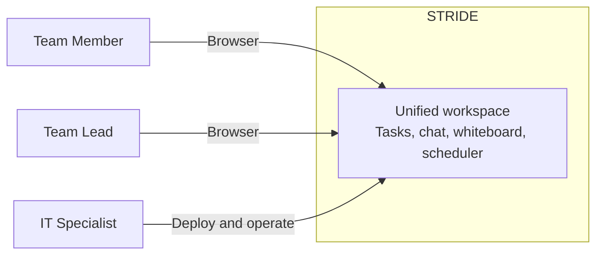
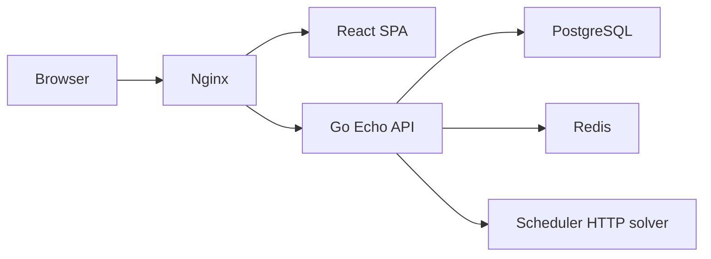
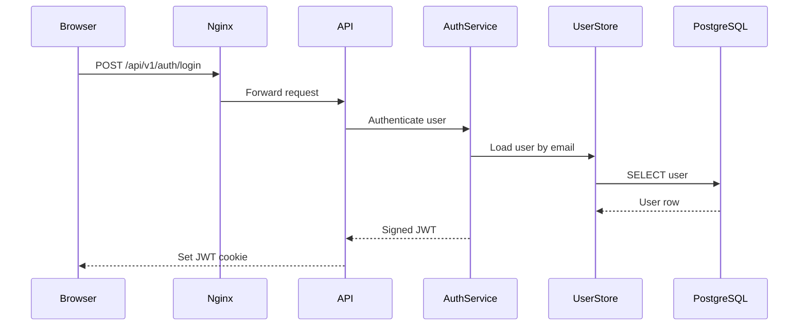
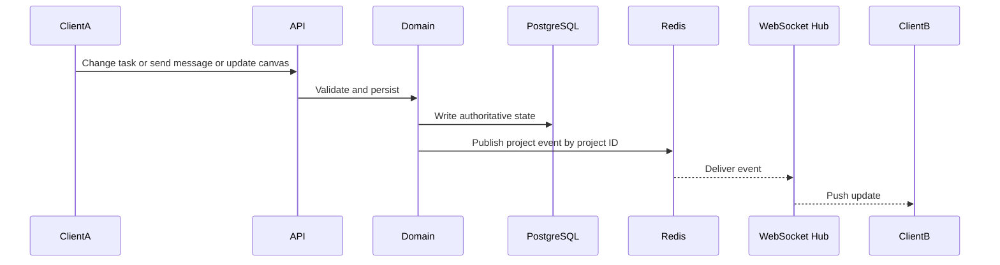
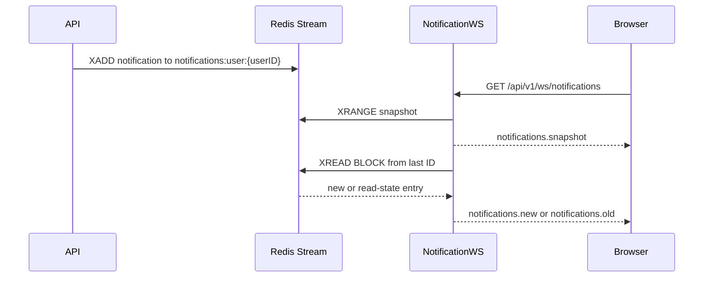
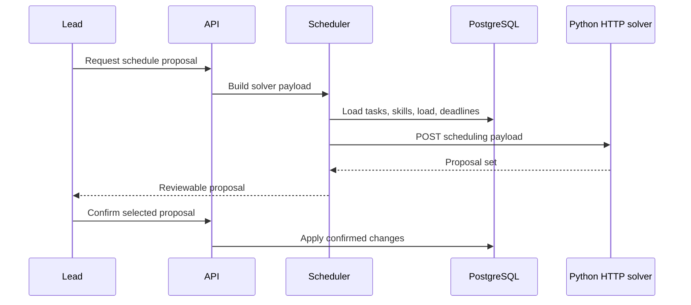
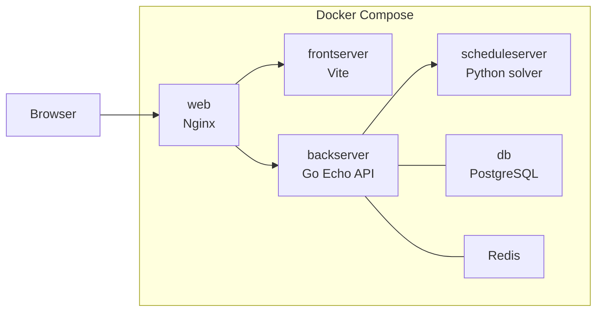

| Field     | Value                                  |
| --------- | -------------------------------------- |
| Document  | Architecture Document                  |
| Project   | STRIDE                                 |
| Version   | 1.1.0                                  |
| Date      | 2026-06-24                             |
| Author    | Ilia Krylov                            |
| Reviewers | A. Fares, B. Komar, O. Fares, P. Bezak |
| Status    | Draft                                  |

## 1. Introduction and Goals

STRIDE is a self-hostable workspace for software teams. System combines project management,
Kanban task board, project chat, collaborative whiteboard, and automated task scheduling in one
Docker Compose stack.

Main functional scope:

- user registration and login with JWT-based session handling
- project creation, membership management, and Owner or Member roles
- task CRUD and Kanban workflow with enforced state machine
- real-time chat, task updates, and whiteboard collaboration
- scheduler proposals based on skill tags, member load, deadlines, and manual confirmation

Key stakeholders and expectations:

| Stakeholder | Expectation                                                                                            |
| ----------- | ------------------------------------------------------------------------------------------------------ |
| Team Member | One workspace for tasks, chat, and whiteboard with predictable permissions.                            |
| Team Lead   | Clear project flow, valid task transitions, and scheduler proposals that can be reviewed before apply. |
| Maintainer  | Simple code structure, explicit decisions, and manageable operational complexity.                      |

Top quality goals:

| Priority | Goal            | Meaning                                                                |
| -------- | --------------- | ---------------------------------------------------------------------- |
| 1        | Maintainability | Clear module boundaries and simple deployment model.                   |
| 2        | Deployability   | Full stack starts with one Docker Compose command.                     |
| 3        | Security        | Authenticated access, role checks, and safe secret handling.           |
| 4        | Reliability     | Real-time collaboration survives disconnects and service restarts.     |
| 5        | Responsiveness  | Task moves, chat messages, and whiteboard updates feel near real time. |

## 2. Constraints

| Constraint                            | Impact on architecture                                      |
| ------------------------------------- | ----------------------------------------------------------- |
| Docker Compose only                   | Favors few deployable services and simple runtime topology. |
| MIT-licensed product                  | Encourages permissive open-source dependencies.             |
| Human confirmation gate for scheduler | Scheduler may propose changes, not auto-apply them.         |

## 3. Context and Scope

STRIDE sits between users and their project data. Runtime scope stays inside browser, reverse
proxy, API, PostgreSQL, and Redis. System has no mandatory external runtime systems.

External actors and interfaces:

| Actor or System | Interface                                                    |
| --------------- | ------------------------------------------------------------ |
| Team Member     | Uses browser UI over HTTP or HTTPS and WebSocket or WSS.     |
| Team Lead       | Uses browser UI over HTTP or HTTPS and WebSocket or WSS.     |
| IT Specialist   | Deploys, configures, and operates stack with Docker Compose. |

Out of scope:

- native mobile apps
- video or audio calls
- email notifications
- third-party calendar integrations
- external identity providers
- Kubernetes deployment manifests
- plugin marketplace
- offline or PWA mode
- AI-generated planning or analytics

## 4. Solution Strategy

Core solution ideas:

- Modular application for business logic, packaged as one Go backend service
- React single-page application for workspace UI
- REST API for CRUD and command flows
- WebSocket channels for real-time task, chat, and whiteboard events
- PostgreSQL as durable system of record
- Redis pub/sub for project event fan-out across connected clients
- Redis Streams for short-lived per-user notifications
- Nginx as single browser entry point
- Scheduler adapter in Go calls an HTTP solver service, then waits for human confirmation

Technology summary:

| Concern                  | Choice                                            |
| ------------------------ | ------------------------------------------------- |
| Frontend                 | React, TypeScript, Vite, Redux Toolkit, RTK Query |
| UI components            | HeroUI, Tailwind CSS, lucide-react                |
| Whiteboard canvas        | Excalidraw                                        |
| Backend                  | Go, Echo, GORM                                    |
| Persistent storage       | PostgreSQL                                        |
| Real-time transport      | gorilla/websocket                                 |
| Real-time event backbone | Redis pub/sub                                     |
| User notification buffer | Redis Streams                                     |
| Scheduler                | Go adapter plus Python HTTP solver                |
| Reverse proxy            | Nginx                                             |
| Packaging                | Docker Compose                                    |

## 5. Building Block View

Static structure has two levels: deployment containers and internal application modules.

Internal structure:

| Building block                | Responsibility                                                                                     |
| ----------------------------- | -------------------------------------------------------------------------------------------------- |
| Frontend pages and components | Workspace screens, navigation, Kanban UI, chat UI, Excalidraw whiteboard UI, scheduler review UI.  |
| Frontend store                | RTK Query API cache, feature cache patching, view state, and WebSocket lifecycle handling.         |
| API routes                    | HTTP endpoints for auth, users, projects, tasks, chat, whiteboard, and scheduler actions.          |
| Domain services               | Business rules, task state machine, membership rules, scheduler orchestration.                     |
| Persistence layer             | Go stores, models, SQL migrations, PostgreSQL access, and transitional GORM usage.                 |
| Real-time hub                 | Project-scoped WebSocket sessions, Redis pub/sub fan-out, cursor hubs, and reconnect-safe clients. |
| Notification stream           | Per-user Redis Stream with snapshot, live delivery, read-state append, and delete.                 |
| Whiteboard flusher            | Background worker that folds Redis pending whiteboard operations into PostgreSQL.                  |
| Scheduler adapter             | Go service that maps project tasks and members to solver payloads and returns proposals.           |

Logical modules:

| Module                  | Main responsibility                                                         |
| ----------------------- | --------------------------------------------------------------------------- |
| Auth and User           | Registration, login, profile updates, password changes, session validation. |
| Projects and Membership | Project lifecycle, invitations, roles, join flows.                          |
| Tasks and Kanban        | Task CRUD, assignment, ordering, and enforced state transitions.            |
| Chat                    | Project-scoped messages and history.                                        |
| Notifications           | Per-user notification snapshots and live updates.                           |
| Whiteboard              | Excalidraw canvas state, live events, cursor presence, task links, presets. |
| Scheduler               | Constraint payload building, HTTP solver call, proposal review, apply flow. |

Current codebase state:

| Area       | Current state                                                                                                               |
| ---------- | --------------------------------------------------------------------------------------------------------------------------- |
| Backend    | Layered split: `routes`, `services`, `db`, `models`; Echo handlers compose stores and services manually in `cmd/server.go`. |
| Frontend   | Feature split: `pages`, `components`, `store`, `shared`; RTK Query owns REST cache and socket lifecycle.                    |
| Real-time  | Project events use Redis pub/sub; frontend refetches or invalidates authoritative state after reconnect.                    |
| Whiteboard | Excalidraw elements persist in PostgreSQL; live updates and pending writes use Redis; cursor presence is process-local.     |
| Scheduler  | Go backend calls `scheduleserver` over HTTP in dev Compose; prod Compose currently has no scheduler service entry.          |

## 6. Runtime View

Important runtime scenarios:

**Login**

**Real-time collaboration flow**

Same event path used for task moves, chat messages, and whiteboard updates.

**Notification delivery flow**

**Scheduler proposal flow**

## 7. Deployment View

STRIDE runs as one Docker Compose stack.

Service mapping:

| Service          | Purpose                               | Dev mapping                        | Prod mapping                         |
| ---------------- | ------------------------------------- | ---------------------------------- | ------------------------------------ |
| `web`            | Browser entry point and reverse proxy | internal `8080` -> external `8080` | internal `80` -> external `443 + 80` |
| `frontserver`    | SPA runtime                           | internal `3000` -> external `-`    | internal `3000` -> external `-`      |
| `backserver`     | REST API and WebSocket endpoint       | internal `8000` -> external `8000` | internal `8000` -> external `-`      |
| `scheduleserver` | Python scheduler solver               | internal `7270` -> external `7270` | missing in current Compose file      |
| `db`             | durable relational storage            | internal `5432` -> external `5432` | internal `5432` -> external `-`      |
| `redis`          | pub/sub, streams, pending state       | internal `6379` -> external `6379` | internal `6379` -> external `-`      |

Deployment principles:

- start stack with one Docker Compose command
- keep secrets in environment variables
- keep PostgreSQL and Redis state in named volumes
- expose one browser-facing entry point through Nginx

## 8. Crosscutting Concepts

| Concept         | Rule                                                                                                                                           |
| --------------- | ---------------------------------------------------------------------------------------------------------------------------------------------- |
| Authentication  | JWT-based session token in secure, HTTP-only cookie.                                                                                           |
| Authorization   | Project roles are Owner and Member; non-auth endpoints require authentication.                                                                 |
| API style       | REST endpoints return JSON; API contract documented with OpenAPI.                                                                              |
| Persistence     | PostgreSQL is single source of truth; schema managed by migrations.                                                                            |
| Real-time sync  | WebSocket sessions grouped by project scope; Redis pub/sub distributes project events; clients reconnect with exponential back-off and jitter. |
| Notifications   | Per-user Redis Streams buffer transient notifications; snapshot is sent before live `XREAD` updates.                                           |
| Task workflow   | Valid task transitions follow Backlog -> In Progress -> Review -> Done.                                                                        |
| Scheduler       | Constraint solver proposes assignments; user reviews and confirms before apply.                                                                |
| Whiteboard sync | Excalidraw canvas uses REST snapshots, Redis-backed live events, pending-operation flush, and task-region links.                               |
| Error handling  | API returns consistent error payloads; request logging and health checks support operations.                                                   |
| Security checks | Dependency and static checks belong in build pipeline.                                                                                         |

## 9. Architectural Decisions

Major decisions:

| Decision                              | Reason                                                                         | Reference                                                       |
| ------------------------------------- | ------------------------------------------------------------------------------ | --------------------------------------------------------------- |
| Go plus Echo for backend              | Small runtime, explicit structure, simple deployment.                          | [ADR-0001](adr/0001-go-echo-vs-gin-vs-node-nestjs.md)           |
| PostgreSQL as durable store           | Strong relational model for users, projects, tasks, chat, and whiteboard data. | [ADR-0002](adr/0002-postgresql-as-sole-source-of-truth.md)      |
| Redis for event fan-out               | Supports project-scoped real-time collaboration.                               | [ADR-0003](adr/0003-redis-pubsub-vs-in-memory-hub.md)           |
| coder/websocket target superseded     | Current code uses gorilla/websocket.                                           | [ADR-0004](adr/0004-coder-websocket-vs-gorilla-vs-nhooyr.md)    |
| Store layer over relational DB        | Keeps persistence separate from handlers and services.                         | [ADR-0005](adr/0005-sqlc-vs-gorm-vs-raw-database-sql.md)        |
| Modular monolith                      | Fits product scope and deployment constraints better than microservices.       | [ADR-0006](adr/0006-modular-monolith-vs-microservices.md)       |
| Redis Streams for notifications       | Gives transient replay for disconnected notification clients.                  | [ADR-0007](adr/0007-redis-streams-for-user-notifications.md)    |
| Goroutine split for real-time workers | Keeps long-lived sockets, hub owners, pingers, readers, and flushers bounded.  | [ADR-0008](adr/0008-goroutine-split-for-realtime-workers.md)    |
| gorilla/websocket and Redis hub       | Matches current backend and keeps project fan-out simple.                      | [ADR-0009](adr/0009-gorilla-websocket-and-redis-project-hub.md) |
| Whiteboard framework decision         | Needed to lock Excalidraw versus alternatives and ownership boundaries.        | [ADR-0010](adr/0010-whiteboard-framework.md)                    |
| Task-Scheduler using Google Or-Tools | Using an CP-SAT solver to efficiently solve complex optimization problems. | [ADR-0011](adr/0011-task-scheduler-or-tools.md)

Proposed additional ADRs:

| Candidate decision                                                                                 | Why it matters now                                                                                       |
| -------------------------------------------------------------------------------------------------- | -------------------------------------------------------------------------------------------------------- |
| Frontend state management: RTK Query cache patching vs global Redux slices vs TanStack Query       | Current sockets patch RTK Query cache; this should be intentional before more real-time views are added. |
| Auth/session model: HTTP-only JWT cookie, CSRF policy, and WebSocket origin checks                 | Current WebSocket upgrader accepts all origins; deployment security needs explicit policy.               |
| Whiteboard consistency model: last-write-wins plus pending flush vs OT or CRDT                     | Current merge/rollback model is simpler than CRDT; concurrent edit semantics need documented limits.     |
| Scheduler deployment: sidecar service vs embedded Go solver vs external service                    | Dev Compose has `scheduleserver`; prod Compose does not. This affects deployability.                     |
| API contract governance: generated OpenAPI and typed frontend clients vs manual RTK endpoint types | Swagger exists, but frontend types are hand-maintained; drift risk is already listed.                    |

## 10. Quality Requirements

Quality tree:

- performance
- security
- reliability
- maintainability
- portability
- usability

Key scenarios:

| Quality         | Scenario                                                                                                                        |
| --------------- | ------------------------------------------------------------------------------------------------------------------------------- |
| Performance     | When team member moves task, sends chat message, or draws on whiteboard, other connected clients receive update near real time. |
| Security        | When client calls non-auth endpoint, request is accepted only with valid authentication and role checks.                        |
| Reliability     | When WebSocket connection drops, frontend shows reconnecting state and retries with exponential back-off.                       |
| Maintainability | When change is merged, code passes lint and tests and major architecture changes have explicit rationale.                       |
| Portability     | System runs in latest stable Chrome and Firefox and starts through Docker Compose on clean host.                                |
| Usability       | Daily work for task tracking, messaging, and sketching happens in one project workspace without tool switching.                 |

## 11. Risks and Technical Debt

| Item                                        | Impact                                                                                 |
| ------------------------------------------- | -------------------------------------------------------------------------------------- |
| Migration lifecycle must stay forward-only  | Destructive rollback on startup or shutdown can destroy persistent data.               |
| Access-control checks must stay centralized | Scattered or missing authorization rules create inconsistent protection.               |
| Real-time reconnect storms                  | Large reconnect bursts can overload API and Redis if back-off is weak.                 |
| Scheduler complexity                        | Constraint rules can become hard to explain if proposal output is not transparent.     |
| Scheduler production deployment gap         | `scheduleserver` exists in dev Compose but not in current prod Compose.                |
| Whiteboard conflict handling                | Last-write-wins is simple but can overwrite simultaneous edits on same element.        |
| OpenAPI contract drift                      | API documentation can diverge from endpoints if not generated or reviewed in pipeline. |
| Deployment drift                            | Nginx, backend, frontend, and Compose settings must stay aligned across environments.  |
| Test environment fragility                  | Weak integration setup reduces confidence in runtime behavior.                         |

## 12. Glossary

| Term            | Meaning                                                        |
| --------------- | -------------------------------------------------------------- |
| ADR             | Architecture Decision Record.                                  |
| API             | Application Programming Interface.                             |
| JWT             | JSON Web Token.                                                |
| RBAC            | Role-Based Access Control.                                     |
| REST            | HTTP-based resource interface.                                 |
| SPA             | Single-Page Application.                                       |
| WebSocket       | Persistent bidirectional browser-server connection.            |
| Redis pub/sub   | Message distribution mechanism for real-time events.           |
| State machine   | Rule set that defines valid task status transitions.           |
| CSP             | Constraint Satisfaction Problem used by scheduler.             |
| OpenAPI         | Machine-readable API contract.                                 |
| Last-write-wins | Conflict rule where newest accepted update replaces older one. |
